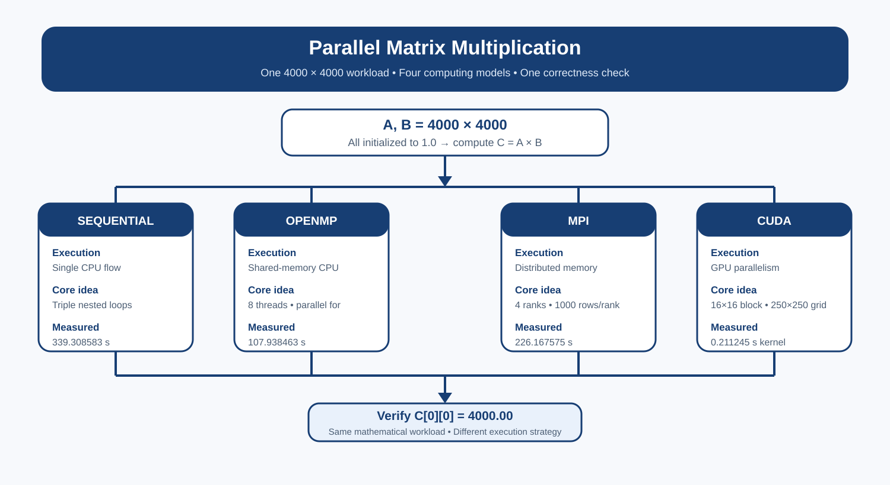
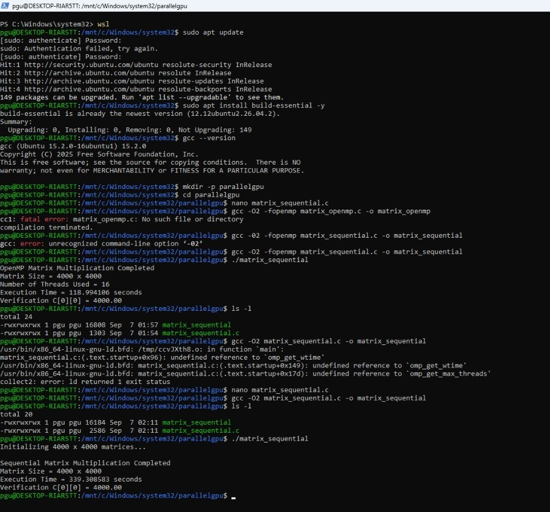
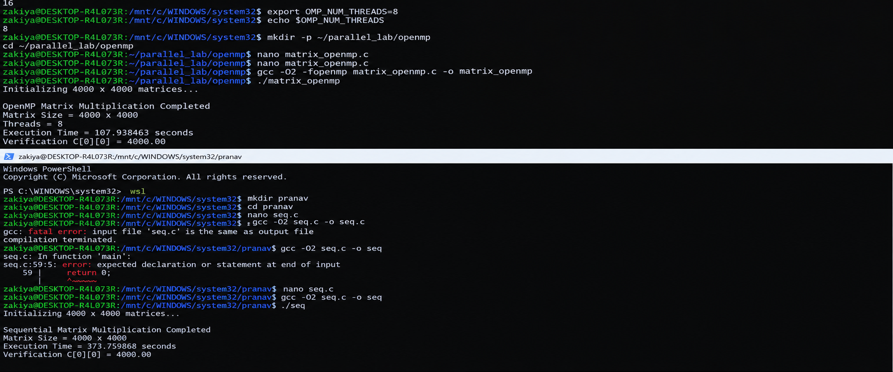
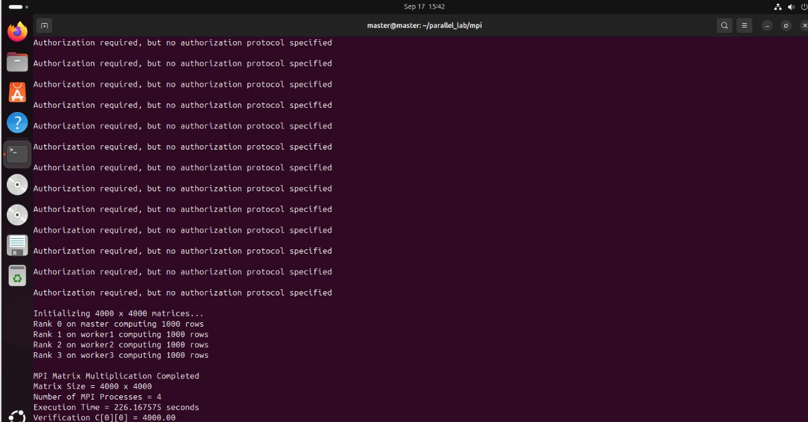
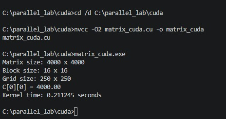

# ⚡ Parallel Matrix Multiplication Lab

> **One 4000 × 4000 problem. Four computing models. One correctness check.**

   

This repository implements the same matrix multiplication workload using four different execution models:

- **Sequential CPU** — one execution flow
- **OpenMP** — shared-memory CPU parallelism
- **MPI** — distributed-memory parallelism across four processes / VMs
- **CUDA** — GPU parallelism using a 2D grid of CUDA threads

The repository is intentionally **implementation-focused rather than a copy of the full lab manual**. It contains the source code, concise working notes, result evidence, and the measured comparison from the actual runs.

### 🧩 Explore the Four Implementations

| 📁 Module | What it demonstrates | Evidence |
|---|---|---|
| [Sequential](sequential/) | CPU baseline with one execution flow | Result screenshot + C source |
| [OpenMP](openmp/) | Shared-memory CPU parallelism with 8 threads | Result screenshot + C source |
| [MPI](mpi/) | Distributed-memory execution with 4 processes | Result screenshot + MPI source |
| [CUDA](cuda/) | GPU kernel execution with a 2D grid of threads | Result screenshot + CUDA source |

---

## 🎯 Problem at a Glance

For every implementation:

```text
A = 4000 × 4000, all elements = 1.0
B = 4000 × 4000, all elements = 1.0
C = A × B
```

Each output value is:

```text
C[i][j] = Σ A[i][k] × B[k][j]
```

Since there are 4000 terms of `1.0 × 1.0`:

```text
Expected verification → C[0][0] = 4000.00
```

All four implementations produced this verification value.

---

## 🧭 Experiment Flow



The four programs perform the same mathematical operation; what changes is **where and how the work is executed**.

---

## 🧠 What Changes Between the Four Versions?

| Implementation | Execution model | Main idea | Configuration |
|---|---|---|---|
| **Sequential** | CPU, single flow | Triple nested loops run one after another | 1 execution flow |
| **OpenMP** | Shared-memory CPU | Outer-loop iterations are divided among threads | 8 OpenMP threads |
| **MPI** | Distributed memory | Rows are divided among independent processes | 4 MPI processes / 4 VMs |
| **CUDA** | GPU parallelism | Each CUDA thread computes an output element | 16×16 block, 250×250 grid |

The core matrix multiplication remains `O(N³)`; the experiment changes the execution strategy and therefore the elapsed time.

---

# 📊 Recorded Results

These are the **actual values from the result screenshots used in this repository**.

| Implementation | Resources / configuration | Recorded time | Relative to sequential | Verification |
|---|---|---:|---:|---:|
| Sequential | CPU single execution flow | **339.308583 s** | 1.00× | ✅ 4000.00 |
| OpenMP | 8 CPU threads | **107.938463 s** | **3.14×** | ✅ 4000.00 |
| MPI | 4 processes / 4 VMs | **226.167575 s** | **1.50×** | ✅ 4000.00 |
| CUDA | 16×16 blocks, 250×250 grid | **0.211245 s** *(kernel)* | **1606.23×** *(kernel)* | ✅ 4000.00 |

### Important measurement note

The CUDA screenshot records **kernel execution time** (`0.211245 s`). The CUDA program also measures a separate total CUDA phase, including host-to-device and device-to-host transfers, but that total value is not visible in the supplied screenshot. Therefore the table labels the CUDA comparison as **kernel-only** rather than presenting it as an identical whole-program measurement.

Likewise, timings depend on the hardware, VM/network conditions, CPU load, compiler/runtime, and system state at the time of execution. The table is a record of this laboratory run, not a universal performance ranking.

---

## 🔍 Why Do the Results Differ?

### 1. Sequential CPU

The program uses the standard three nested loops:

```text
for i
    for j
        for k
            C[i][j] += A[i][k] × B[k][j]
```

There is no explicit parallel execution, so this becomes the baseline for the comparison.

### 2. OpenMP CPU

OpenMP keeps the same algorithm but parallelizes the outer loop:

```c
#pragma omp parallel for private(j, k)
```

Different rows can be processed concurrently because the iterations are independent. The eight threads still work on CPU cores sharing the same memory.

### 3. MPI

MPI uses separate processes with separate address spaces. In this experiment:

```text
Rank 0 → 1000 rows
Rank 1 → 1000 rows
Rank 2 → 1000 rows
Rank 3 → 1000 rows
```

The important communication stages are:

```text
MPI_Scatter → distribute A rows
MPI_Bcast   → share B with all ranks
Compute     → each rank forms local_C
MPI_Gather  → collect the result on Rank 0
```

Because the experiment uses multiple VMs, communication and virtual-network overhead are part of the MPI execution.

### 4. CUDA

CUDA moves the computation to the GPU. The manual configuration uses:

```text
Block = 16 × 16 = 256 threads
Grid  = 250 × 250 blocks
```

A thread identifies its `(row, column)` position and computes one output element of `C`. For a 4000×4000 matrix, the launch configuration creates enough logical threads to cover the output matrix.

---

# 🗂️ Repository Structure

```text
parallel-matrix-multiplication/
│
├── README.md
├── .gitignore
│
├── sequential/
│   ├── README.md
│   ├── matrix_sequential.c
│   └── results/
│       └── final_output.png
│
├── openmp/
│   ├── README.md
│   ├── matrix_openmp.c
│   └── results/
│       └── final_output.png
│
├── mpi/
│   ├── README.md
│   ├── matrix_mpi.c
│   ├── hosts.example
│   └── results/
│       └── final_output.png
│
├── cuda/
│   ├── README.md
│   ├── matrix_cuda.cu
│   └── results/
│       └── final_output.png
│
└── docs/
    └── benchmark-notes.md
```

---

# ▶️ Run the Experiments

## Sequential

```bash
gcc -O2 matrix_sequential.c -o matrix_sequential
./matrix_sequential
```

## OpenMP

```bash
export OMP_NUM_THREADS=8
gcc -O2 -fopenmp matrix_openmp.c -o matrix_openmp
./matrix_openmp
```

## MPI

On the Master VM:

```bash
mpicc -O2 matrix_mpi.c -o matrix_mpi
```

Copy the executable to the worker nodes and launch four processes using the hostfile:

```bash
scp matrix_mpi worker1:~/matrix_mpi
scp matrix_mpi worker2:~/matrix_mpi
scp matrix_mpi worker3:~/matrix_mpi
mpirun -np 4 --hostfile hosts sh -c '$HOME/matrix_mpi'
```

`mpi/hosts.example` shows the four-node layout used by the experiment.

## CUDA

In a CUDA-capable environment:

```bash
nvcc -O2 matrix_cuda.cu -o matrix_cuda
```

Windows CMD:

```bat
matrix_cuda.exe
```

Linux:

```bash
./matrix_cuda
```

---

# 🧪 Evidence / Result Screenshots

### Sequential



### OpenMP



### MPI



### CUDA



---

# ✅ What Was Verified?

The most important correctness check is consistent across all four runs:

```text
C[0][0] = 4000.00
```

That confirms the implementations are producing the expected result for the initialized test case while using different execution models.

---

# 💡 Key Learning

This experiment is not simply about making a loop “faster.” It demonstrates four different ways of executing the same workload:

```text
Sequential  → one CPU execution flow
OpenMP      → many CPU threads sharing memory
MPI         → many processes communicating across nodes
CUDA        → massive thread-level GPU parallelism
```

The real lesson is the relationship between **computation, memory, communication, and hardware architecture**.

---

## 📚 Source Basis

The repository follows the structure and terminology of the supplied laboratory manual: a 4000×4000 matrix workload, sequential CPU baseline, OpenMP shared-memory execution, four-process MPI distribution with 1000 rows per rank, and the CUDA 16×16 block / 250×250 grid configuration.

The README intentionally keeps only the material needed to understand, run, verify, and evaluate the implementation; detailed environment-installation and troubleshooting steps remain outside the repository summary.
