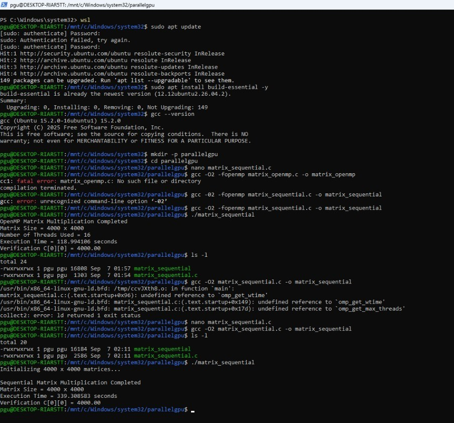

# Parallel Matrix Multiplication — Sequential & OpenMP

This repository contains two implementations of the same **4000 × 4000 matrix multiplication** performed for the parallel computing laboratory:

- **Sequential CPU:** single execution flow; used as the performance baseline.
- **OpenMP CPU:** shared-memory parallel execution using **8 threads**.

The goal is to keep the workload and correctness check identical while observing the effect of CPU parallelism on execution time.

## Experiment Flow


```text
4000 × 4000 matrices
        ↓
Initialize A and B with 1.0
        ↓
 ┌───────────────┬────────────────┐
 │ Sequential    │ OpenMP         │
 │ Single flow   │ 8 CPU threads  │
 └───────┬───────┴───────┬────────┘
         ↓                ↓
       Matrix Multiplication
               ↓
       Verify C[0][0]
               ↓
      Compare execution time
```

## Common Workload

For both programs:

- `A` = 4000 × 4000, all elements = `1.0`
- `B` = 4000 × 4000, all elements = `1.0`
- `C = A × B`
- Expected `C[i][j] = 4000.00`
- Time complexity of the standard algorithm: **O(N³)**

Because each output element is the sum of 4000 values of `1.0 × 1.0`, the verification value should be `4000.00`.

## Repository Structure

```text
parallel-matrix-multiplication/
├── README.md
├── .gitignore
├── sequential/
│   ├── matrix_sequential.c
│   └── results/
│       └── final_output.png
├── openmp/
│   ├── matrix_openmp.c
│   └── results/
│       └── final_output.png
└── docs/
    ├── experiment-flow.png
    └── results-comparison.md
```

## Experiment 1 — Sequential

### Approach

The matrix multiplication uses the standard three nested loops over `i`, `j`, and `k`. No parallel library is used, so the computation provides the baseline for comparison.

### Build and Run

```bash
gcc -O2 matrix_sequential.c -o matrix_sequential
./matrix_sequential
```

### Recorded Result

| Metric | Value |
|---|---:|
| Matrix size | 4000 × 4000 |
| Execution time | **339.308583 s** |
| Verification | **4000.00** |
| Purpose | Baseline |

### Result Evidence



The result is correct because `C[0][0] = 4000.00`, matching the expected value for the initialized matrices.

## Experiment 2 — OpenMP

### Approach

The mathematical computation remains the same. The outer matrix row loop is parallelized using:

```c
#pragma omp parallel for private(j, k)
```

The recorded run uses **8 OpenMP threads**. Different iterations of the outer loop can therefore be processed concurrently while the matrices remain in shared memory.

### Build and Run

```bash
export OMP_NUM_THREADS=8
gcc -O2 -fopenmp matrix_openmp.c -o matrix_openmp
./matrix_openmp
```

### Recorded Result

| Metric | Value |
|---|---:|
| Matrix size | 4000 × 4000 |
| Threads | **8** |
| Execution time | **107.938463 s** |
| Verification | **4000.00** |

### Result Evidence


The output confirms that 8 threads were used and that the computed matrix passed the same correctness check.

## Performance Comparison

The measured speedup is calculated against the sequential run:

```text
Speedup = Sequential Time / OpenMP Time
        = 339.308583 / 107.938463
        ≈ 3.14×
```

| Implementation | Execution Time | Parallelism | Verification | Speedup |
|---|---:|---|---:|---:|
| Sequential | 339.308583 s | Single flow | 4000.00 | 1.00× |
| OpenMP | 107.938463 s | 8 threads | 4000.00 | **3.14×** |

### Observation

OpenMP reduces the measured execution time because independent outer-loop iterations are executed concurrently by multiple CPU threads. The speedup is below the ideal 8× because practical execution includes thread/runtime overhead, memory-access effects, and hardware limitations.

The two implementations perform the **same mathematical workload** and produce the **same verification value**, making the timing comparison meaningful for this experiment.

## Learning Outcome

This experiment demonstrates the transition from a single CPU execution flow to shared-memory CPU parallelism and shows how the change in execution model affects measured performance.

## Reproducibility Note

Execution time depends on the machine, CPU load, WSL configuration, and runtime conditions. The values reported above are the timings from the recorded experimental runs included in this repository.
