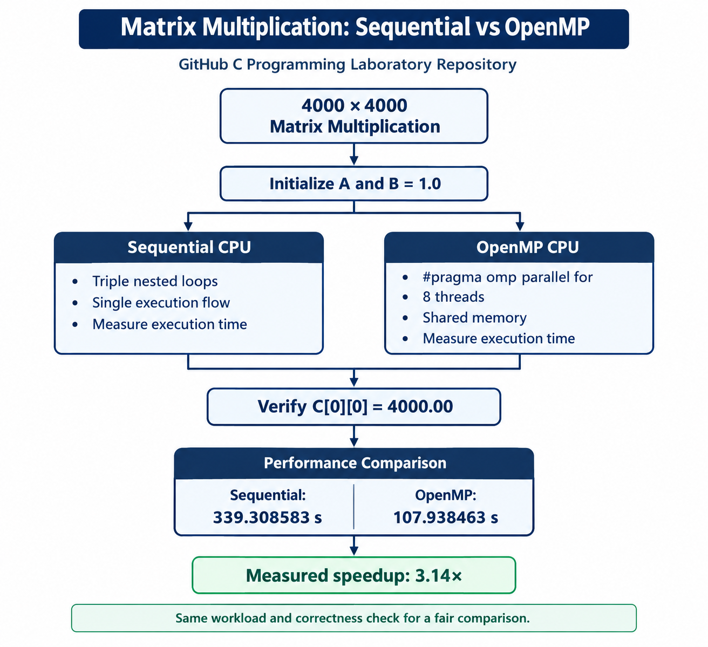
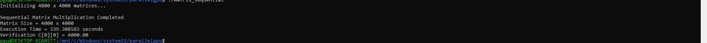
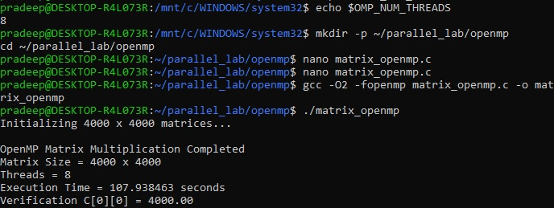

# Parallel Matrix Multiplication — Sequential & OpenMP

A concise laboratory implementation of the same **4000 × 4000 matrix multiplication** using two CPU execution models:

- **Sequential:** one execution flow, used as the baseline.
- **OpenMP:** shared-memory parallelism using **8 threads**.

The main purpose is to observe how shared-memory parallelism changes execution time while keeping the mathematical workload and correctness check the same.

## Experiment Flow



### Common Workload

For both programs:

- `A` = 4000 × 4000, all elements `1.0`
- `B` = 4000 × 4000, all elements `1.0`
- `C = A × B`
- Expected value: `C[i][j] = 4000.00`

The reference lab defines the expected output in the same way: each result element is the sum of 4000 products of `1.0 × 1.0`. fileciteturn0file0L121-L123

## Repository Structure

```text
parallel-matrix-multiplication/
├── README.md
├── .gitignore
├── sequential/
│   ├── matrix_sequential.c
│   ├── README.md
│   └── results/
│       └── final_output.png
├── openmp/
│   ├── matrix_openmp.c
│   ├── README.md
│   └── results/
│       └── final_output.png
└── docs/
    ├── experiment-flow.png
    └── results-comparison.md
```

## 1. Sequential Matrix Multiplication

### What is done?

The program performs the standard triple-nested matrix multiplication loop. No parallel framework is used, so the complete computation runs sequentially.

**Time complexity:** `O(N³)`

### Build and Run

```bash
gcc -O2 matrix_sequential.c -o matrix_sequential
./matrix_sequential
```

`-O2` enables compiler optimization. The lab uses this compilation approach for the sequential implementation. fileciteturn0file0L514-L530

### Recorded Result

| Metric | Recorded value |
|---|---:|
| Matrix size | 4000 × 4000 |
| Execution time | **339.308583 s** |
| Verification | **4000.00** |
| Role | Baseline |

### Result Evidence



The important evidence is that the multiplication completed successfully and `C[0][0] = 4000.00`, confirming the expected result.

[Detailed Sequential README →](sequential/README.md)

---

## 2. OpenMP Matrix Multiplication

### What is changed?

The mathematical algorithm remains the same, but the outer `i` loop is parallelized with:

```c
#pragma omp parallel for private(j, k)
```

The recorded experiment uses **8 OpenMP threads**. This follows the lab's shared-memory approach, where outer-loop iterations are divided among CPU threads. fileciteturn0file0L597-L601

### Build and Run

```bash
export OMP_NUM_THREADS=8
gcc -O2 -fopenmp matrix_openmp.c -o matrix_openmp
./matrix_openmp
```

The lab specifies `OMP_NUM_THREADS=8` and `-fopenmp` for the OpenMP build. fileciteturn0file0L659-L675 fileciteturn0file0L865-L879

### Recorded Result

| Metric | Recorded value |
|---|---:|
| Matrix size | 4000 × 4000 |
| Threads | **8** |
| Execution time | **107.938463 s** |
| Verification | **4000.00** |

### Result Evidence



The output confirms both parallel execution with 8 threads and correct matrix multiplication.

[Detailed OpenMP README →](openmp/README.md)

---

## 3. Performance Comparison

Speedup is calculated relative to the recorded sequential baseline:

```text
Speedup = Sequential Time / OpenMP Time
        = 339.308583 / 107.938463
        ≈ 3.14×
```

| Implementation | Time | Verification | Speedup vs Sequential |
|---|---:|---:|---:|
| Sequential | 339.308583 s | 4000.00 | 1.00× |
| OpenMP — 8 threads | 107.938463 s | 4000.00 | **3.14×** |

### Interpretation

The OpenMP version completed the same workload in less elapsed time because independent outer-loop iterations could be executed concurrently by multiple CPU threads. The measured result is not exactly 8× because real execution includes thread/runtime overhead, memory access effects, and hardware limitations.

The lab also identifies the same reason for OpenMP's improvement: work is shared among multiple CPU threads while the matrices remain in shared memory. fileciteturn0file0L944-L949

> **Note:** These are the timings recorded from the submitted run screenshots. Execution time can vary with CPU load, WSL configuration, and system conditions.

## Learning Outcome

This experiment demonstrates the transition from:

```text
Sequential CPU
      ↓
Same O(N³) computation
      ↓
OpenMP shared-memory parallelism
      ↓
Measured execution-time improvement
```

The next experiments in the larger lab workflow can extend this comparison to **MPI distributed memory** and **CUDA GPU parallelism**. fileciteturn0file0L68-L81
