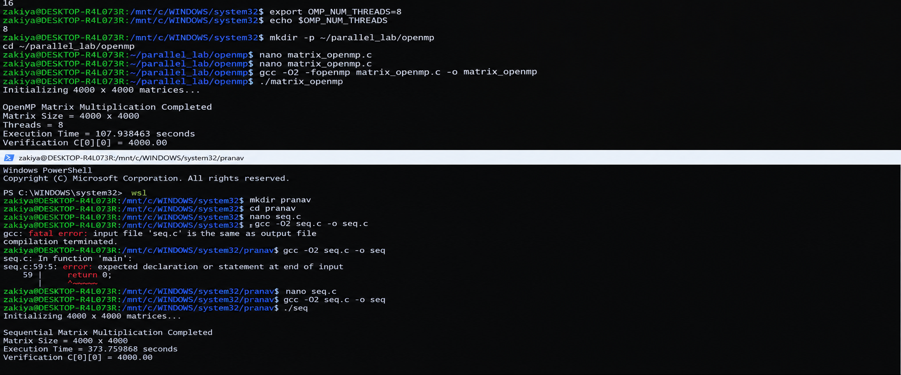

# Experiment 2 — OpenMP Matrix Multiplication

## Objective

Use OpenMP shared-memory parallelism to execute the same `4000 × 4000` matrix multiplication with 8 CPU threads and compare it with the sequential baseline.

## Parallelization

The outer loop is parallelized using:

```c
#pragma omp parallel for private(j, k)
```

Each thread works on different outer-loop iterations, so separate rows of `C` can be calculated concurrently.

## Build & Run

```bash
export OMP_NUM_THREADS=8
gcc -O2 -fopenmp matrix_openmp.c -o matrix_openmp
./matrix_openmp
```

## Recorded Result

```text
OpenMP Matrix Multiplication Completed
Matrix Size = 4000 x 4000
Threads = 8
Execution Time = 107.938463 seconds
Verification C[0][0] = 4000.00
```

| Metric | Value |
|---|---:|
| Matrix size | 4000 × 4000 |
| Threads | **8** |
| Execution time | **107.938463 s** |
| Verification | **4000.00** |
| Speedup vs sequential | **3.14×** |

## Why this result matters

The OpenMP program performs the same mathematical work, but multiple CPU threads execute independent portions at the same time. For this recorded run, the execution time decreased from **339.308583 s** to **107.938463 s**.

### Speedup

```text
339.308583 / 107.938463 ≈ 3.14×
```

This is an observed speedup, not an ideal 8× scaling result; thread/runtime overhead and memory-system effects prevent perfect linear scaling.

## Final Output


